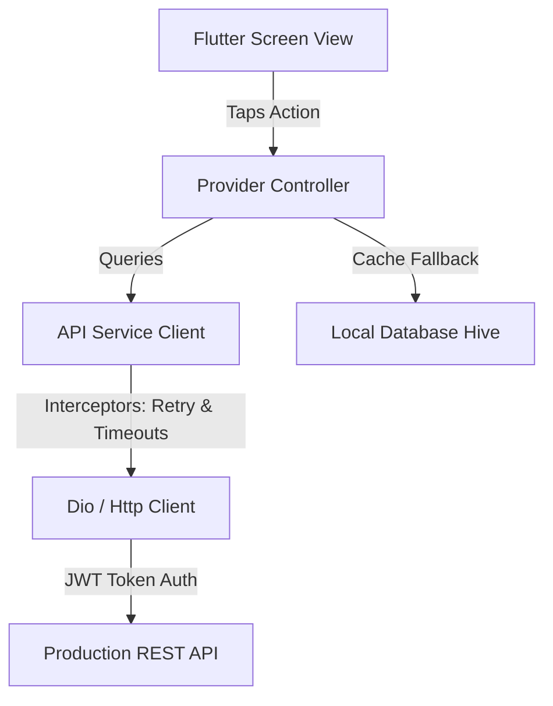

# API Analysis Report - Backend Integration

This document analyzes the current backend integration status of the **NAND Store** Flutter project and outlines the architectural migration path.

## Current Integration Status Summary

> [!NOTE]
> The project currently runs on a **simulated local-first architecture**. There are no HTTP requests, WebSocket channels, or external REST API integrations. All interactions are handled in memory by `StoreProvider` and `AuthProvider` with mock network latency.

| Architectural Component | Current Implementation | Status | Recommendation / Action Plan |
| :--- | :--- | :--- | :--- |
| **REST API** | Mocked in memory (`Future.delayed`) | 🟡 Simulated | Implement `dio` or `http` with Retrofit client |
| **Authentication** | Simulated state in `AuthProvider` | 🟡 Simulated | Integrate OAuth endpoints, JWT storage |
| **Error Handling** | Local validator callbacks & dialogues | 🟢 Implemented | Map server-side exceptions (4xx/5xx) to local errors |
| **Caching** | Temporary Provider memory states | 🟡 In-Memory | Add `shared_preferences` / Hive local caching |
| **Offline Mode** | Natural (all data is preloaded locally) | 🟢 Enabled | Store responses in Hive database for offline read-access |
| **Pagination** | Local sliding page indices (4 items/page) | 🟢 Implemented | Standardize cursor-based API page query parameters |
| **Retry Mechanism** | N/A (all requests succeed locally) | 🔴 Missing | Add Dio `RetryInterceptor` with exponential backoff |
| **Timeouts** | N/A | 🔴 Missing | Configure 15s connection/receive timeouts in HTTP Client |

---

## Detailed Architectural Review

### 1. REST API Simulation
All product, cart, category, and checkout endpoints are mocked in state controllers:
*   **Seeded Catalog**: Loaded from `dummyProducts` list in `lib/models/store_models.dart`.
*   **Checkout**: Modifies Provider `_orders` list with artificial transaction delays of `2.2 seconds` in `lib/screens/checkout_screen.dart`.

### 2. Authentication Flow
*   Handled by `AuthProvider` (`lib/providers/auth_provider.dart`).
*   Mock latency is applied (`1500ms`) during login/signup to simulate real server checks.
*   *Security storage*: Tokens are currently held in standard memory variables.

### 3. Error Handling & Validation
*   **Client side**: String validators check email symbols, passwords length, and billing detail conditions before submitting.
*   **Simulated exceptions**: Triggered inside checkout dialogues if card details start with `0000` (Insufficent Funds simulation) to test UI resilience.

### 4. Caching & Storage Persistence
*   Memory persistence holds wishlist, orders, search history, and cart details.
*   No database libraries (`sqlite`, `hive`, `sembast`) are currently registered in `pubspec.yaml`.

### 5. Pagination Framework
*   **Scrolling feed**: Home Screen feeds lists via `_scrollListener` checking scrolling boundary offsets (`maxScrollExtent - offset < 200`).
*   **Offset Loading**: Page index `_page` increments to fetch slices of 4 products from the local array, presenting shimmer skeleton widgets during mock loading.

---

## API Migration Strategy

To transition from the simulated provider database to a production-grade backend service:



### 1. Dependency Updates
Append the following package requirements to `pubspec.yaml`:
```yaml
dependencies:
  dio: ^5.4.0              # Advanced HTTP Client (interceptors, timeouts)
  retrofit: ^4.1.0         # Type-safe API client generation
  flutter_secure_storage: ^9.0.0 # Encrypted key-value persistence for JWT
  hive_flutter: ^1.1.0     # Offline caching database
```

### 2. Timeouts & Interceptor Rules
Initialize `Dio` client using standard timeout settings and recovery hooks:
```dart
final dio = Dio(BaseOptions(
  baseUrl: 'https://api.nandstore.com/v1',
  connectTimeout: const Duration(seconds: 15),
  receiveTimeout: const Duration(seconds: 15),
));

// Add exponential backoff retry rule
dio.interceptors.add(RetryInterceptor(
  dio: dio,
  retries: 3,
  retryDelays: const [
    Duration(seconds: 1),
    Duration(seconds: 3),
    Duration(seconds: 9),
  ],
));
```
