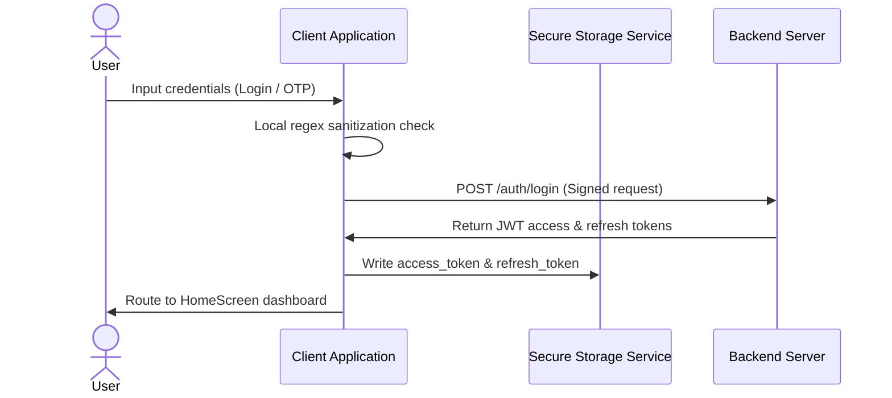

# Authentication Flow Chart

This document maps the user session authentication flow:

```mermaid
sequenceDiagram
  actor User
  participant App as Client Application
  participant SecureStorage as Secure Storage Service
  participant API as Backend Server

  User->>App: Input credentials (Login / OTP)
  App->>App: Local regex sanitization check
  App->>API: POST /auth/login (Signed request)
  API->>App: Return JWT access & refresh tokens
  App->>SecureStorage: Write access_token & refresh_token
  App->>User: Route to HomeScreen dashboard
```
