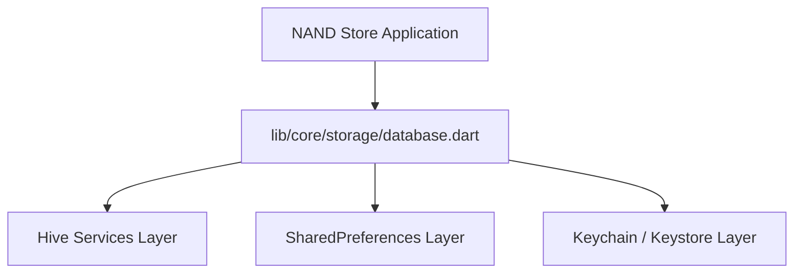

# Database Architecture

This document details the local storage design patterns implemented for the **NAND Store** e-commerce Flutter application.

## 1. Storage Services Overview

Our local database relies on three separate structural layers:

### 1.1 Hive Database Services (`hive_service.dart`)
*   **Encrypted Boxes**: Sensitive customer transactions, cart items, and profiles (`users`, `orders`, `cart`) are dynamically encrypted.
*   **Plain Boxes**: Public catalogs (`products`, `categories`, `wishlist`, `notifications`, `search_history`, `recent_products`, `settings`, `app_cache`).

### 1.2 SharedPreferences (`preferences_service.dart`)
*   Manages plain-text client states (Theme mode, Language code, Currency conversions, First launch toggles, and Last sync timestamps).

### 1.3 Keychain / Keystore (`secure_storage_service.dart`)
*   Utilizes `FlutterSecureStorage` with Hardware Keystore backed configurations to protect auth JWT access/refresh tokens and AES database keys.

---

## 2. Security and Data Protection

*   **AES-256 Block Cipher Encryption**: Generates a 256-bit encryption key on initial startup using `Hive.generateSecureKey()`.
*   **Key Lifecycle**: The key is written immediately to Encrypted Secure Storage, never hitting plaintext shared preferences or local database files.
*   **Disk Compaction**: Compact commands run on boot via `compact()` to reclaim disk sectors and clean deleted records.
