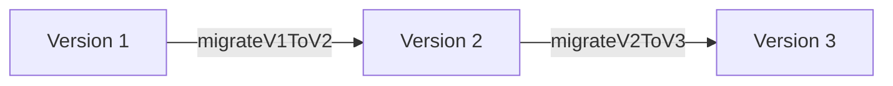

# Database Migration Guide

This document outlines the schema versioning, upgrades pipelines, and data preservation mechanics of the **NAND Store** application database.

## 1. Schema Versioning Rules

*   **Current Database Version**: `2`
*   The current version is hardcoded inside `MigrationManager.currentSchemaVersion` and stored on-disk under SharedPreferences key `db_schema_version`.
*   During application boot, `MigrationManager.instance.performMigrationChecks()` queries the active SharedPreferences version. If it's less than `currentSchemaVersion`, it executes sequential migrations blocks.

---

## 2. Upgrades Pipelines



### 2.1 Migration 1 to 2 (`_migrateV1ToV2`)
*   **Target**: Cart items in `cart` box.
*   **Action**: Converts raw Map payloads, injecting `migrated_at` and `version` parameters to ensure schema consistency.
*   **Recovery Safeguard**: If any error happens during block execution, the corrupted box file is deleted from disk to prevent startup app crashes, enabling clean app resets.

---

## 3. Best Practices for Adding Future Upgrades

1.  **Increment Version**: Change `currentSchemaVersion` to `3` in `migration_manager.dart`.
2.  **Declare Method**: Write `Future<void> _migrateV2ToV3()` details.
3.  **Register Execution**:
    ```dart
    if (version == 2) {
      await _migrateV2ToV3();
    }
    ```
