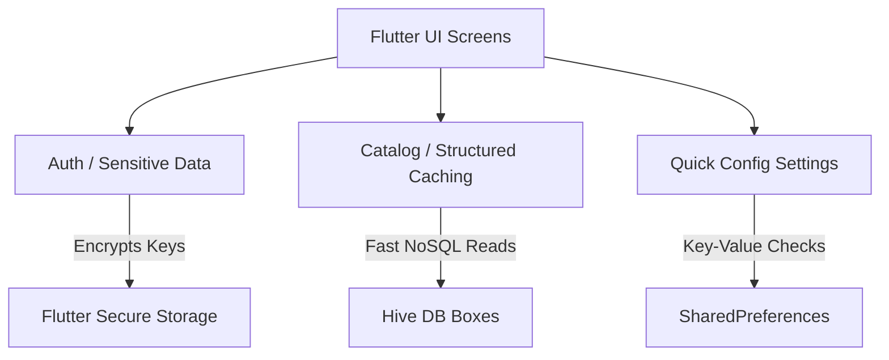

# Local Database Analysis Report

This document reviews the current local storage capabilities of the **NAND Store** Flutter app and designs a production database persistence layer.

## Current Persistence Analysis

> [!WARNING]
> The current application does **NOT** persist data across app launches. All user credentials, cart selections, transaction orders, search keywords, and wishlist arrays reside purely in active RAM memory governed by State Provider models. Restarting the process resets all tables.

### Storage Profile Verification

*   **Hive**: 🔴 **Not Integrated** (No `.g.dart` adapters or TypeAdapters configured).
*   **SQLite / Sqflite**: 🔴 **Not Integrated** (No SQL schema tables or helper classes).
*   **SharedPreferences**: 🔴 **Not Integrated** (No user configuration caches).
*   **Flutter Secure Storage**: 🔴 **Not Integrated** (API tokens, passwords, and sessions are not encrypted on disk).

---

## Architectural Proposal for Database Layer

To implement high-performance, secure, and robust data persistence, we recommend a hybrid storage architecture:



### 1. Storage Choice Matrix

| Data Classification | Storage Medium | Rationale |
| :--- | :--- | :--- |
| **User Access Tokens / JWT** | `flutter_secure_storage` | Uses iOS Keychain and Android Keystore (AES encryption) to protect credentials. |
| **Settings (Theme, Language)** | `shared_preferences` | Lightweight XML/plist key-value mapping for fast preference checks. |
| **Catalog, Wishlist, Cart, Orders**| `hive` (NoSQL) | Fast read/write performance, lightweight footprint, and built-in type serialization. |

---

## Database Migration & Optimization Blueprint

### 1. Data Integrity & TypeAdapters
To store custom Dart objects (like `Product`, `CartItem`, and `NotificationItem`) inside Hive, create TypeAdapters to serialize them to binary formats:
```dart
import 'package:hive/hive.dart';
part 'store_models.g.dart';

@HiveType(typeId: 0)
class HiveCartItem extends HiveObject {
  @HiveField(0)
  late String productId;

  @HiveField(1)
  late int quantity;

  @HiveField(2)
  late String selectedSize;
}
```

### 2. Indexes & Performance Tuning
*   **Compacting Boxes**: Call `Hive.box('cart').compact()` periodically to release deleted records disk space.
*   **Pre-fetching keys**: Cache index queries for checkout logs to avoid seeking disks during infinite scrolling.

### 3. Migrations Strategy
As schemas evolve (e.g., adding discount codes to orders), use schema versioning numbers in your databases:
```dart
// Hive Version Migration Example
void openHiveBoxes() async {
  final box = await Hive.openBox('orders');
  final int currentSchemaVersion = box.get('schema_version', defaultValue: 1);
  
  if (currentSchemaVersion < 2) {
    // Run schema upgrade routine (e.g. migrate field mapping)
    box.put('schema_version', 2);
  }
}
```
