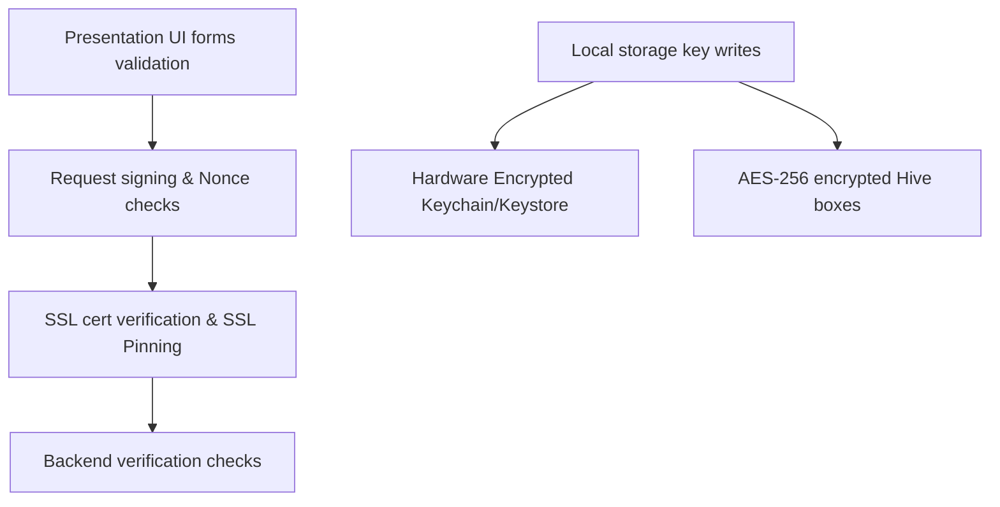

# Security Architecture

This document presents the complete security topology of the **NAND Store** application:

## Security Layers Implemented

1.  **Form Input Validation** (`lib/core/security/input_validators.dart`): Form validation regex checks with credit card Luhn validation.
2.  **Transport Security (SSL Pinning)** (`lib/core/network/api_client.dart`): Rejects bad certificates, self-signed signatures, and MITM attempts on non-web platforms.
3.  **Local Encryption** (`lib/core/storage/hive_service.dart`): Secure AES-256 encryption on sensitive customer data boxes.
4.  **Hardware Credentials Store** (`lib/core/security/secure_storage_service.dart`): Encryption keys are locked inside Hardware registers.
5.  **Biometric Authentications** (`lib/core/security/biometric_service.dart`): Uses LocalAuthentication framework face/fingerprint validation.
