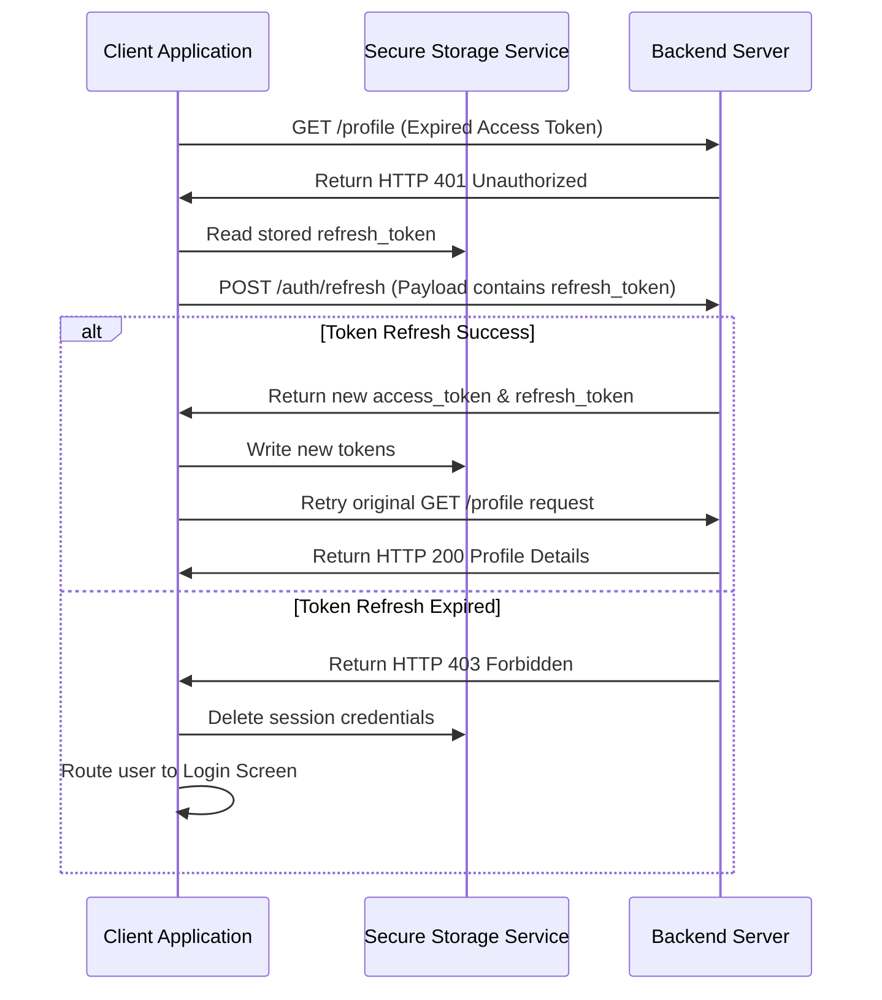

# Token Lifecycle Flow Chart

This document details the token expiration and 401 refresh request recovery lifecycle:

```mermaid
sequenceDiagram
  participant App as Client Application
  participant SecureStorage as Secure Storage Service
  participant API as Backend Server

  App->>API: GET /profile (Expired Access Token)
  API->>App: Return HTTP 401 Unauthorized
  App->>SecureStorage: Read stored refresh_token
  App->>API: POST /auth/refresh (Payload contains refresh_token)
  alt Token Refresh Success
    API->>App: Return new access_token & refresh_token
    App->>SecureStorage: Write new tokens
    App->>API: Retry original GET /profile request
    API->>App: Return HTTP 200 Profile Details
  else Token Refresh Expired
    API->>App: Return HTTP 403 Forbidden
    App->>SecureStorage: Delete session credentials
    App->>App: Route user to Login Screen
  end
```
